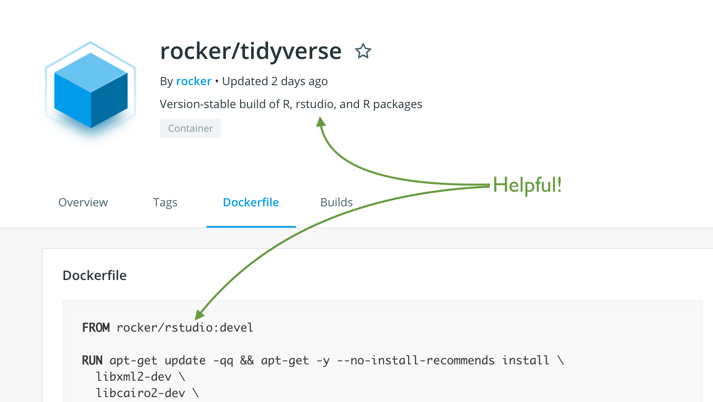
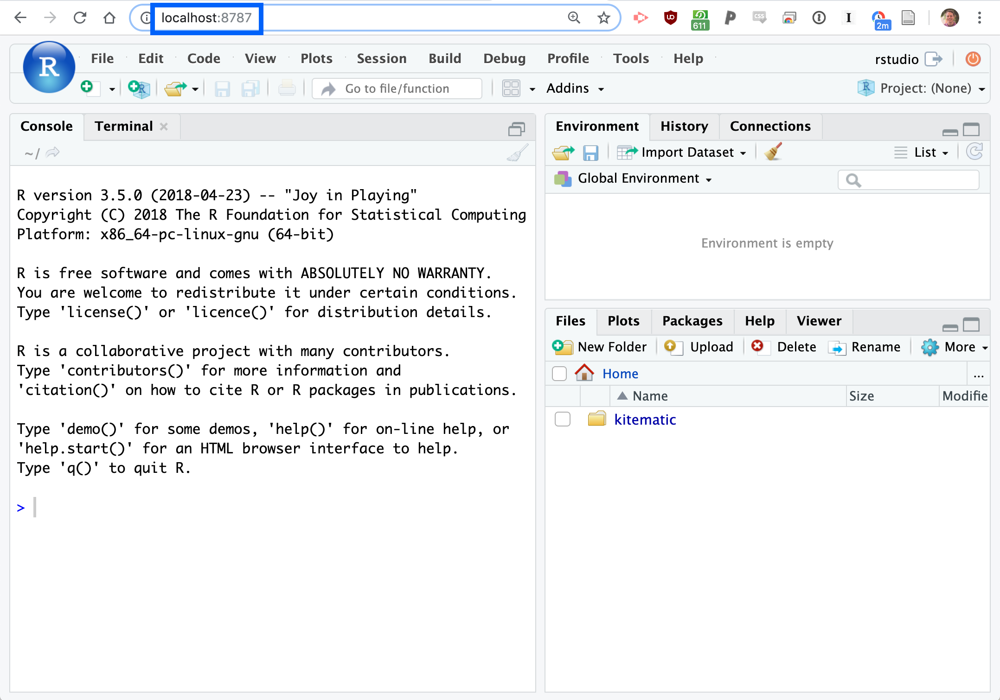
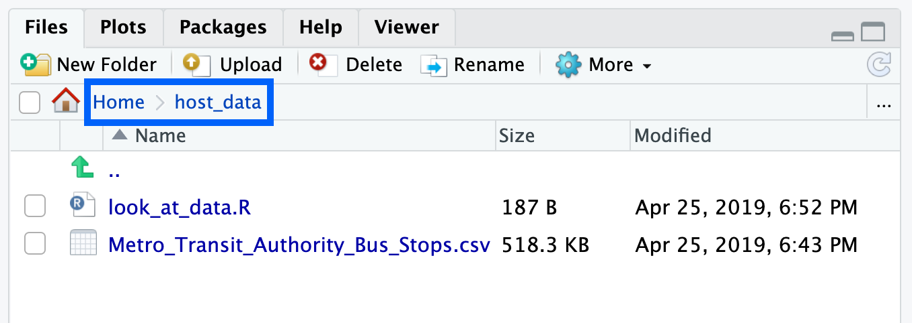
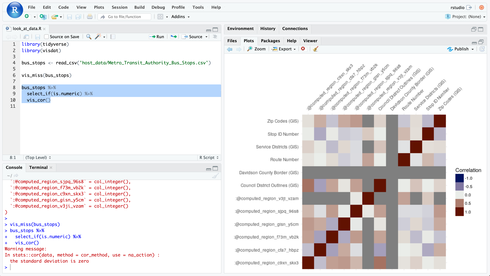

```{r setup, include=FALSE}
devtools::install_github('nstrayer/tuftesque2')
knitr::opts_chunk$set(echo = TRUE)
```

## Goal

The goal of this document/ presentation is to take you (a biostatistician or similar) from knowing nothing about Docker to being able to utilize it in your research through a simple example.

## Links

This presentation is located at [nickstrayer.me/docker_for_biostatisticians](http://nickstrayer.me/docker_for_biostatisticians/). 

Source code and demo files are located on the github at [github.com/nstrayer/docker_for_biostatisticians](https://github.com/nstrayer/docker_for_biostatisticians)

## A brief history

Docker was developed for software engineering. As software has gotten more complex and applications more numerous the act of manually configuring a new server every time you needed to scale up was simply too high. To deal with this Docker [When I use the name "Docker" here I really am referring to any container or Virtual Machine (VM) software.]{.side-note} software was built. Docker exists as a method of recreating an image of a server with all its software installed etc. in a single command. 

Docker's job is to make it so a programmer only has to sit and type out `sudo apt-get install clang...` once and then anytime they have a new machine they just use the Docker 'image' to start from a setup just like they had it before, guaranteed. 

[]{.side-note}

## What does Docker do for us?

Quickly before I bore you with a bunch of terminology you could get elsewhere let's motivate _why_ you as a biostatistician/data scientist may want to use Docker.

The reasons why _I_ find Docker valuable falls into five main points: 

- Never worry about if you can get that script to run again because of new versions of a package. 
- Build your modeling workflow on your laptop and then run it on a powerful server without changing anything.
- Someone else has already dealt with those C compiling errors.
- Never spend time emailing back and forth with a grad student trying to get the code from your project running. 
- It's cool and trendy. 

## The Docker workflow:

A typical docker workflow is as follows: 

0. Install Docker on your machine
1. Write a `Dockerfile` that specifies what software you need 
2. Build that Dockerfile to download all the necessary software and wrap it up into an 'image'
3. Run the image that  your Dockerfile generated [A 'container' is just what the image becomes when it is run]{.side-note}
4. (Optional) Save the image for running later so you can skip steps 1 and 2. 

Because I expect that workflow to make approximately zero sense at first blush let's expand on each step. 

### Install Docker

Installing Docker takes a different form on different machines. The main docs do a much better job than I can so I will point you to them. 

[Docker for mac](https://docs.docker.com/v17.12/docker-for-mac/install/)

[Unfortunately as of writing this you need the professional version of windows to run Docker, although this is supposed to change in the near-ish future]{.side-note}
[Docker for windows](https://docs.docker.com/v17.12/docker-for-windows/install/)

[Docker for ubuntu](https://docs.docker.com/v17.12/install/linux/docker-ce/ubuntu/)


### The `Dockerfile`

This is a simple text script that describes the state of the machine. Think of it like a super bash/shell script that does all the typing into the command line for you. So if your usual workflow upon getting a new computer is opening up the terminal and running something like...


```
sudo apt-get install R-Lang, RStudio-Server, ... 
```

This can get translated into the Dockerfile so Docker knows how to get the various software you need. 

That is all great but you may wonder why you don't just use a big bash script here and avoid all this hassle? The beauty of these Docker files is you can stack them, building upon previous images built by you or others. 

__Stacking images__

For instance, say you want to run a machine that has instant access to the version 3.4 of R and the `tidyverse` suite of packages already installed. You can use the [Rocker project](https://www.rocker-project.org/) who kindly provide pre-built images with different R versions etc for you.

[Note the stacking of the shipping containers in the logo. ]{.side-note}

```
# ./DOCKERFILE
# Start from image with R 3.3.1 and tidyverse installed
FROM rocker/tidyverse:3.3.1

...
# Add your own desired packages etc. on top
```

Let's setup a super simple example of building a docker image with both the tidyverse and another custom package [`visdat`](http://visdat.njtierney.com/) to look at data overviews.

<div style="text-align:center;">

</div>

```
FROM rocker/tidyverse:3.5.0

# Install visdat from github
RUN R -e "devtools::install_github('ropensci/visdat')"
```


## Building the Dockerfile

Now that we have our simple dockerfile we can 'build' it. This simply means we tell our computer to go and grab all the necessary files and construct the image for use. [Run this from the same directory you made your `./Dockerfile`]{.side-note}

```
$ docker build -t tidy_vizdat .
```

After you do this you'll get a nice matrix-esque string of status bars...

```
Sending build context to Docker daemon  50.18kB
Step 1/2 : FROM rocker/tidyverse:3.5.0
3.5.0: Pulling from rocker/tidyverse
54f7e8ac135a: Pull complete...
```

These show you progress of the downloading and constructing of your new image! 

Once this completes you now have an image. This means that no matter what happens you will always be able to run this image and it will work the same. [Note that if you don't specify versions for packages if you rebuild the image at a later date things may not be identical, but as long as you don't rebuild the image when you run the image it will always be the same]{.side-note}

## Running the image, aka starting your container

Now that your container is built all you need to do is use the `run` command to start it up and enter. 

```
docker run -it tidy_vizdat bash
```

This says run your just created image and enter it in a `bash` shell. After a second you will have your terminal look something like this: 

::::{.side-note}
<iframe src="https://giphy.com/embed/3o7bu4qyWzTS0UWTmw" width="480" height="270" frameBorder="0" class="giphy-embed" allowFullScreen></iframe><p><a href="https://giphy.com/gifs/art-dance-christmas-3o7bu4qyWzTS0UWTmw">via GIPHY</a></p>
::::


```
$ docker run -it tidy_vizdat bash
root@061df01792d0:/#
```

You are now in the container! It's just a linux machine running within your computer. We can open R and run our world-changing calculations...


```
root@061df01792d0:/# R

R version 3.5.0 (2018-04-23) -- "Joy in Playing"
Copyright (C) 2018 The R Foundation for Statistical Computing
Platform: x86_64-pc-linux-gnu (64-bit)
...
Type 'q()' to quit R.

> 4 * 3
[1] 12
```

Beautiful! Now to close everything simply type `exit` into the terminal and Docker will shut down the container and it will be like nothing ever happened!

## Going beyond the basics

But wait, this isn't particularly helpful. What if we wanted to use RStudio or import data. Fret not these are possible as well. 

### Using RStudio (aka port-mapping)

The image that we loaded also happens to have RStudio-Server loaded on it. This means that if we can get access to the container from our web browser we can use everyone's favorite IDE to work/ run scripts. 

[The beauty of container stacking in action. They just added some the tidyverse on top of their already built RStudio image. DRY comes to software installation!]{.side-note}



To make our web browser able to connect into the container we need to tell Docker that we want to map some local port to the container's internal ports. Aka if we have a server that is running on port `8787` like RStudio-Server does, we need to make sure our local computers `8787` is simply mapped into the container's. 

Luckily, this just means a couple changes to the `docker run` command. 

```
docker run -it -p 8787:8787 -e DISABLE_AUTH=true tidy_vizdat
```

Note that we have added `-p 9000:8787` which tells docker to map port `9000` on our computer to port `8787` in the container. In addition we have added `-e DISABLE_AUTH=true` which just tells RStudio we don't want to use the login screen. [To see more about customizing these behaviours such as when you need more security read the [Rocker docs](https://www.rocker-project.org/use/managing_users/)]{.side-note} Last we simple left off the `bash` at the end of the command because we will do our accessing of the container through the web browser. 



Once you've completed all you came to do you can shut everything down by pressing control + c in the terminal you called `docker run...` in. 


### Sending stuff in (and out)

One thing you may have noticed is that our container is 'empty'. It has no files or anything. This is not very useful for much beyond a glorified calculator. So how do we get files in and our of our container? 

The short answer is: mounting a directory. [The long answer is: ['lots of different ways.'](https://docs.docker.com/storage/)]{.side-note}

Much like mapping a port was telling docker to wire up a communications port with the container, mapping a directory just does the same thing with a directory on your computer. You say, I want to map my directory `data/` to the directory `host_data/` inside the docker container. 

This is again done by adding an argument to the `run` command...

The `-v /local/host/folder/:/home/rstudio/folder` command mounts a directory from a local folder to the container. 

```
docker run -it \
  -v $(pwd)/data/:/home/rstudio/host_data \
  -p 127.0.0.1:8787:8787  \
  -e DISABLE_AUTH=true tidy_vizdat
```

[Note that if you are running this on a computer with multiple accounts and restrictive permissions on files you may need to modify the internal user in your Dockerfile to make the container account have the same UID as your host account.]{.side-note}
This command will spin-up our `tidy_vizdat` image and mounts a folder with some data in it to the container. 




Now that we have access to data we can do something interesting! 




## Beyond the basics


### Running individual scripts

A lot of times you may simply want to have your image run a single script and be done. [This is actually the vast majority of how Docker is used]{.side-note} Luckily Docker is smart enough to work with this situation. There's a special command you can put at the end of your Docker script: `ENTRYPOINT` that simply tells Docker what to do upon loading, if you don't specify you want to enter an interactive shell by omitting the `i` flag argument to `docker run` the image will run whatever is in your `ENTRYPOINT` and then once everything is idle it will automatically shut down. 

Here's an example of how this is used in a personal project. 

[The `COPY` command is another Dockerfile command that can send a file into your docker image from your local computer when it is built. It's good for one-off scripts etc but not great for loading data etc. There's no easy way to copy out of the container either.]{.side-note}
```
#Dockerfile
...

# Copy the neccesary script into the docker container
COPY run_model_and_save.py /home/analysis/run_model_and_save.py

ENTRYPOINT python run_model_and_save.py
```

This is then run with the `run` command: 

```{bash, eval = FALSE}
docker run -t -v $(pwd):/home/analysis/data/ -w /home/analysis/ graph_tool_custom bash
```

[In a personal project I have that relies on a super-annoying-to-compile C library I wrote an R function that does all this automatically, making running the docker image as easy as a single R function.]{.side-note}

This workflow is critical if you want to start using services like [Kubernetes](https://kubernetes.io/) to massively scale your code. It's also super helpful to have your workflow setup like this if you want to send whatever you've worked on to a large cluster as you can automatically have the machine shut down after your job has finished and not waste any compute time. 


### Saving images to Docker Hub

[It's important to make sure there's nothing sensitive in these images because they are completely public. If you are interested in doing this privately there are options.]{.side-note}
Here I have to refer to [this excellent ROpenSci article on this topic.](https://ropenscilabs.github.io/r-docker-tutorial/04-Dockerhub.html) Docker Hub is like Github but for Docker images. Once you've got an image you like and see yourself or other reusing often you can send it to Docker Hub so it can easily be pulled. 


## More resources

If this whirlwind tour has just left you more confused than before I recommend taking a look at these resources. [Please don't feel bad if this is confusing to you, it took me a long time to figure out the what and why of Docker]{.side-note}


__[Enough Docker to be Dangerous](http://seankross.com/2017/09/17/Enough-Docker-to-be-Dangerous.html)__ _Sean Kross_

Goes into a good amount of detail on the nitty gritty of managing Docker. 

<br/>

__[An Introduction to Docker for R Users](https://colinfay.me/docker-r-reproducibility/)__ _Colin Fay_

A much more thorough introduction to Dockerfile construction than was done here. 

<br/>

__[An Introduction to Rocker: Docker Containers for R](https://journal.r-project.org/archive/2017/RJ-2017-065/index.html)__ _Carl Boettiger and Dirk Eddelbuettel_

All purpose intro to using the Rocker R Docker images. Helps make clear how versioning works and the different image types relate to each-other. 

<br/>

__[Docker for the UseR](https://github.com/noamross/nyhackr-docker-talk)__ _Noam Ross_

Slides and video of a presentation for using Docker focused on examples of various scenarios. Great for expanding upon the simple 'let's run a script' example we did here. 
